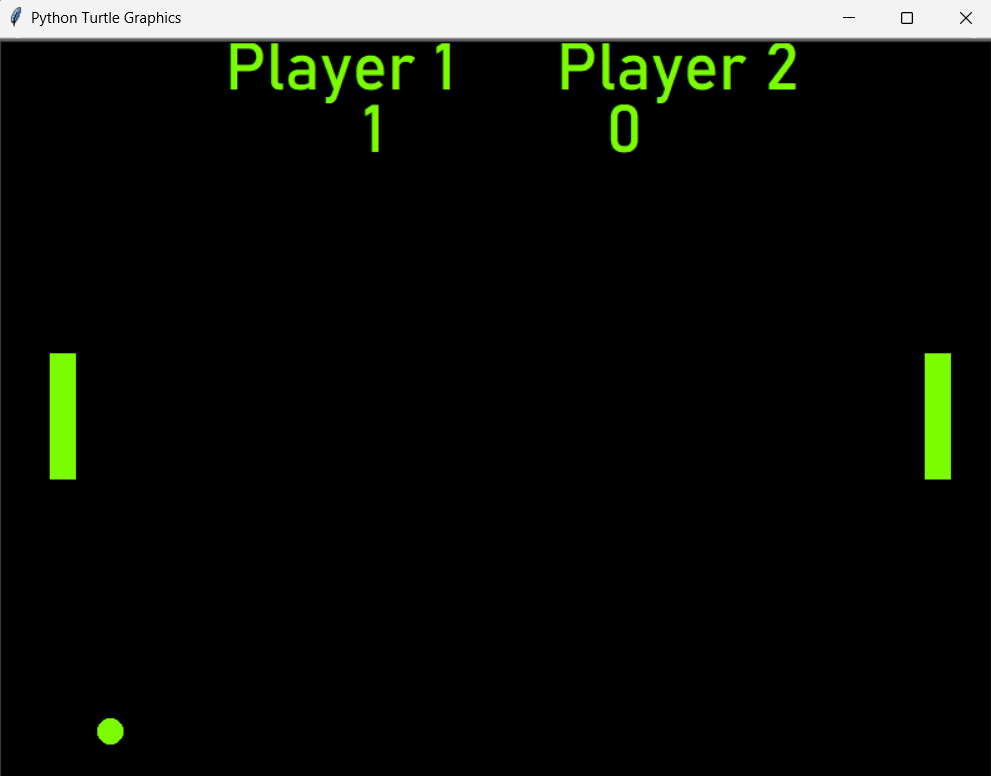

# PONG GAME

A simple implementation of the classic Pong game built using Python's `turtle` module. The game offers two modes: single-player (against the computer) and two-player.

## Features
- **Single-player mode**: Play against a basic computer AI.
- **Two-player mode**: Two players can compete using the same keyboard.
- **Scoreboard**: Keeps track of scores for both players.
- **Winning condition**: The first player (or computer) to reach 11 points wins.
- **Custom background image**: Ping pong table style.

## How to Play
- In **single-player mode**, use the up and down arrow keys to move the paddle.
- In **two-player mode**, Player 1 uses the `W` and `S` keys, and Player 2 uses the up and down arrow keys.
  
### Controls
- **Player 1 (left paddle)**:
  - `W` to move up
  - `S` to move down
- **Player 2 (right paddle)**:
  - `Up arrow` to move up
  - `Down arrow` to move down

## Files and Structure

- **main.py**: Entry point for the game.
- **ball.py**: Contains the `Ball` class to control the ball's movement and behavior.
- **paddle.py**: Contains the `Paddle` class to control the paddles for both players.
- **scoreboard.py**: Contains the `Scoreboard` and `Scoreboard_ai` classes to track the scores for both single and two-player modes.

## Game Modes
### One Player (AI vs. Player)
- The player controls the right paddle using the arrow keys. The computer moves the left paddle automatically to follow the ball.
  
### Two Player
- Two players use the keyboard to control their respective paddles and compete against each other.

.png)

Enjoy playing the classic Pong game!
